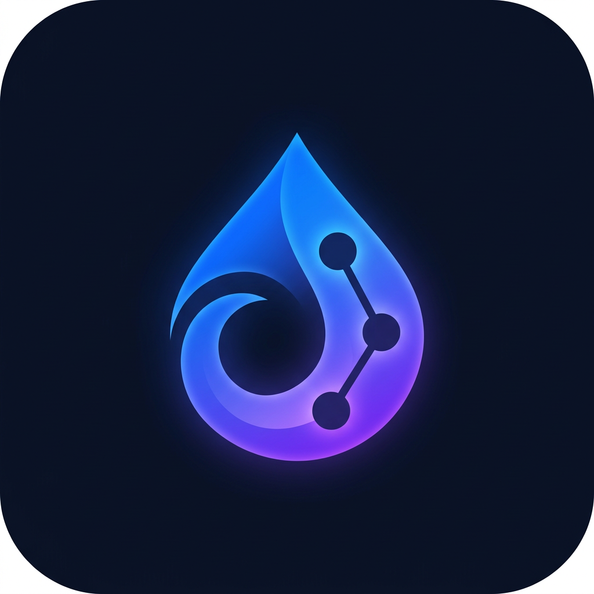

# InkoCaller — Private calls. Just two people.

> Instant, secure video and voice calls with no group clutter. Premium, privacy-first, 1:1 WebRTC calling.



## 🌟 Brand Philosophy

**Inko** = Ink (fluid, personal, human) + Connection. A private mark between two people.

- **Privacy** — No permanent storage, ephemeral sessions, DTLS-SRTP
- **Connection** — Just two people, no group noise
- **Simplicity** — Start → Share → Talk
- **Speed** — P2P WebRTC, low latency
- **Trust** — Server-enforced 2-person limit, open-source

## 🎨 Design System

- **Primary**: Deep navy #0B1020
- **Secondary**: Dark blue #172554
- **Accent**: Electric blue #2563EB
- **Violet**: #7C3AED
- **Background**: #F8FAFC / Dark #020617

Premium, minimal, friendly, fast. Large touch targets, smooth animations, mobile-first.

## 🚀 Quick Start (Free & Open Source)

```bash
# Clone
git clone https://github.com/nishantacharya51-debug/dual-caller
cd dual-caller

# Install
npm install

# Env
cp .env.example .env
# Edit .env if needed (defaults work for local dev)

# Dev (Next.js + Socket.IO signaling in one server)
npm run dev

# Open http://localhost:3000
```

### Docker (Full Stack)

```bash
docker-compose up --build
# App: http://localhost:3000
# TURN: localhost:3478
# Grafana: http://localhost:3001
# Prometheus: http://localhost:9090
```

## 📞 How It Works

1. **Start a Call** → Cryptographically secure session ID (128-bit entropy, base64url)
2. **Share Link** → Copy, native Web Share API, WhatsApp, Messenger, SMS, Email
3. **Friend Joins** → Pre-call device check, permission handling
4. **Talk Privately** → P2P WebRTC, exactly 2 participants enforced server-side

### Strict 2-Person Enforcement

```typescript
participantLimit = 2
if (participantCount >= 2) {
  REJECT third user immediately
  // "This private call already has two participants."
}
```

- Atomic participant reservation (prevents race conditions)
- Server-side validation (not just frontend)
- Token-based auth, HMAC TURN credentials
- No third video tile ever

## 🏗️ Architecture

```
Browser A ↔ Browser B (P2P WebRTC)
    ↕           ↕
  Signaling (Socket.IO + Redis adapter for scale)
    ↕
  Session Store (in-memory + PostgreSQL optional)
    ↕
  TURN (coturn) fallback
```

### WebRTC Stack

- **Signaling**: Node.js + Socket.IO, Redis adapter for horizontal scaling
- **ICE**: STUN (Google, Cloudflare), TURN (coturn with temporary credentials)
- **Security**: DTLS-SRTP, HTTPS/WSS, CSP, HSTS, secure cookies
- **Media**: Adaptive 360p-1080p, bandwidth estimation, jitter buffering

### Components

- `app/` — Next.js 14 App Router, TypeScript, Tailwind
- `components/` — Premium UI, CallScreen, PreCallScreen
- `lib/sessionStore.ts` — Atomic 2-person enforcement
- `lib/webrtcConfig.ts` — ICE servers, media constraints
- `server.js` — Custom Next + Socket.IO server
- `public/manifest.json` — PWA

## 🔒 Security

- HTTPS, HSTS, CSP, X-Frame-Options DENY, X-Content-Type-Options nosniff
- Rate limiting (100 req/min), brute-force protection
- Input validation, output encoding, dependency scanning (daily via GitHub Actions)
- No TURN creds in frontend, temporary HMAC credentials
- Row Level Security if using Supabase/Postgres
- OWASP headers

## 🎥 Features Implemented

- [x] Landing page (premium, mesh gradients, floating cards)
- [x] Call creation (crypto-secure IDs)
- [x] Copy Link, Native Share, WhatsApp, Messenger, SMS, Email
- [x] 2-person enforcement (server-side atomic)
- [x] Third-user rejection ("Call already full")
- [x] Video (adaptive 360p-1080p)
- [x] Audio (echo cancellation, noise suppression, auto gain)
- [x] Mute / Camera toggle
- [x] Screen sharing (getDisplayMedia)
- [x] Chat (ephemeral, 2-person)
- [x] Emoji reactions (animated)
- [x] Captions (Web Speech API, local where possible)
- [x] Noise suppression toggle
- [x] Background blur (CSS filter, performance-aware)
- [x] Beauty filters (brightness, contrast, softness)
- [x] Low-light mode
- [x] Call recording (MediaRecorder, visible consent, local download)
- [x] Reconnection (ICE restart, signaling reconnect)
- [x] TURN fallback (coturn, temp creds)
- [x] Mobile UI (PiP, bottom bar, swipe-friendly)
- [x] PWA (manifest, icons, install prompt)
- [x] HTTPS + security headers
- [x] Rate limiting
- [x] Session expiration (TTL cleanup)
- [x] Connection quality (Excellent/Good/Fair/Poor + diagnostics)
- [x] Device handling (camera/mic switching, Bluetooth where supported)
- [x] Performance (adaptive quality, smoothness-first)

## 📱 Browser Support

- Android Chrome, Firefox
- iOS Safari, Chrome
- Desktop Chrome, Edge, Firefox, Safari
- Minimum 320px width
- Handles orientation, backgrounding, camera switching, Bluetooth

## 🧪 Testing

```bash
npm run test          # Unit tests
npm run test:e2e      # Playwright WebRTC integration

# Mandatory browser test:
# Browser A joins
# Browser B joins
# Browser C is rejected
```

See `tests/webrtc.test.ts` and `tests/security.test.ts`

## 💰 Cost Model

### FREE MVP (Local / Free Tiers)

- Next.js + Socket.IO: Free (Vercel free tier, Cloudflare Pages)
- STUN: Free (Google, Cloudflare)
- TURN: Self-hosted coturn on free compute OR OpenRelay free tier (limited)
- DB: In-memory (or Supabase free tier: 500MB, 50k MAU)
- CDN: Cloudflare free tier
- Monitoring: Prometheus/Grafana self-hosted
- **Limit**: ~100 concurrent calls free, TURN bandwidth limited

### SMALL PRODUCTION (~1k concurrent calls)

- Compute: 2x t3.medium ($50/mo)
- TURN: 1x c5.large + bandwidth (~$100-200/mo for 500GB)
- DB: RDS db.t3.micro ($15/mo) or Supabase Pro $25
- Redis: ElastiCache t3.micro ($15/mo)
- CDN: Cloudflare Pro $20
- **Total**: ~$200-300/mo for 1k calls (2k participants)

### 10,000 CONCURRENT CALLS (20k participants)

- Compute: 10x c5.2xlarge for signaling ($1500/mo)
- TURN: 5x c5.4xlarge, assume 15% TURN usage, 1 Mbps avg, 10k calls = 10 Gbps TURN if 15% = 1.5 Gbps ≈ 500 TB/mo bandwidth → $5000-8000 bandwidth + $1000 compute
- DB: RDS db.r5.large ($200/mo)
- Redis: ElastiCache r5.large ($200/mo)
- CDN: Cloudflare Enterprise negotiated (~$500/mo)
- Monitoring: Managed Prometheus/Grafana $200
- **Total**: ~$9000-12000/mo
- **Note**: P2P saves 85% bandwidth vs SFU. If all P2P, bandwidth cost minimal.

*Do NOT claim free for 10k calls. Document reality.*

## 🌍 12-Region Architecture

Designed via Terraform modules:

- North America (us-east-1, us-west-2)
- South America (sa-east-1)
- Western Europe (eu-west-1)
- Eastern Europe (eu-central-1)
- Middle East (me-south-1)
- India (ap-south-1)
- Southeast Asia (ap-southeast-1)
- East Asia (ap-northeast-1)
- Australia (ap-southeast-2)
- Africa (af-south-1)
- +2 extra for redundancy

Use latency-based routing (Route53, Cloudflare Load Balancer). Do NOT provision 12 regions without auth — Terraform ready.

## 🔧 Deployment

### Free Tier Priority

1. Cloudflare Pages + Workers (free)
2. Vercel free tier
3. Netlify free tier
4. Supabase free tier
5. GitHub Actions
6. Self-hosted coturn

### Production Ready Includes

- Dockerfiles, docker-compose.yml
- Terraform (AWS/GCP/Azure abstraction)
- Kubernetes manifests where needed
- GitHub Actions CI/CD
- .env.example
- Health checks, auto-restart, logging

### Domain & SSL

- Let's Encrypt or Cloudflare auto SSL
- No paid domain auto-purchase
- If free deployment URL provided, deploy there

## 📚 API Docs

- `POST /api/session` — Create secure session
- `GET /api/session?id=xxx` — Check session
- `GET /api/turn` — Get temporary TURN credentials (HMAC)
- `GET /api/health` — Health + stats
- Socket.IO events: `join-session`, `signal`, `chat-message`, `reaction`, `leave-session`

## 🧩 PWA

- manifest.json, icons, service worker (Next.js built-in)
- Install prompt, splash screen, offline shell
- Note: Background WebRTC varies by OS (documented limitation)

## ⚠️ Limitations Honestly Documented

- Cannot prevent OS-level screen recording (browser limitation)
- Background calling differs on iOS vs Android
- Live captions depend on browser SpeechRecognition support
- Free TURN bandwidth limited — production needs paid coturn
- 10k concurrent calls NOT free — see cost model

## 📄 License

MIT — Free and open-source.

## 🙏 Acknowledgments

- WebRTC, coturn, Socket.IO, Next.js, Tailwind
- No branding copied from Instagram, WhatsApp, Zoom, Meet

---

**Built with privacy-first principles. Exactly two people per call. No group clutter. InkoCaller.**
